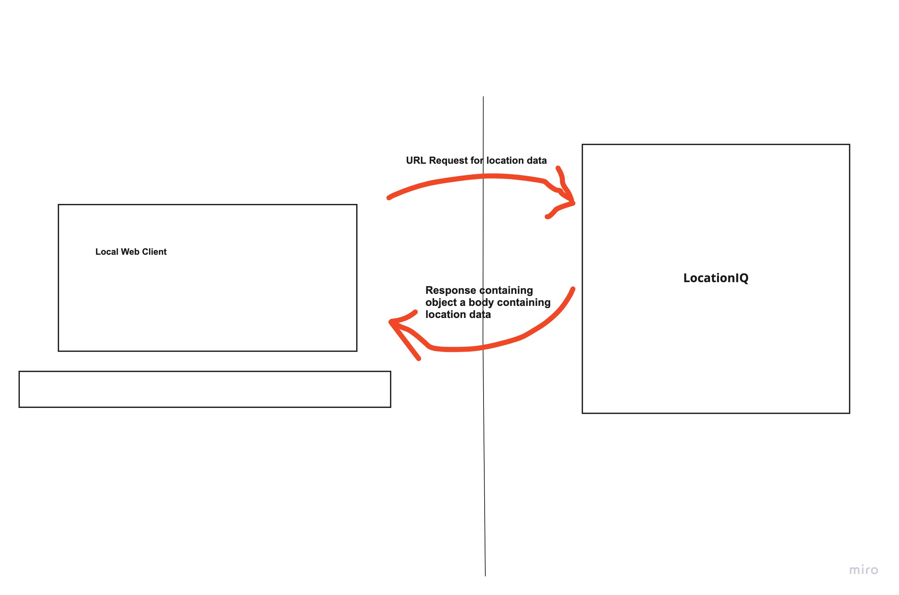
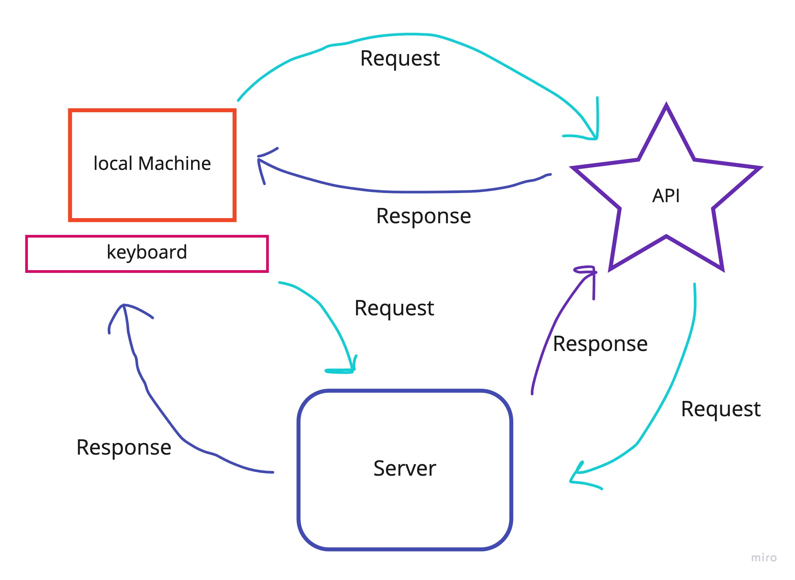

# City Explorer

**Author**: Harvey Francois
**Version**: 1.4.0 

## Overview
This Project is about connect the the front end to the back end, and learning how it work. City explorer app makes api call to get data from the servers and renders specific data for the user. The app renders weather data and movie list depending on what city your searching for. This was a great learning experience. 

## Architecture

#### Lab 6

#### Lab 7

#### Lab 8

## Credit and Collaborations

Ryan Gallaway - 301 instructor
Thank you for your help.

Name of feature: 
lab-6 creating an api connection to location-iq to get the location data and map image.

Estimate of time needed to complete: 2-3 hour

Start time: 02/21/2022

Finish time: 02/25/2022

Actual time needed to complete: ?

Name of feature:
lab-7 creating a local server and connecting to weather-bit to get weather weather information. send the weather data to the app and have it render with the location.

Estimate of time needed to complete: 3-4 hour

Start time: 02/21/2022

Finish time: 02/25/2022

Actual time needed to complete: ?

Name of feature: 
lab-8 connecting local server to movie-DB to get data and render it to the app.

Estimate of time needed to complete: 3-4 hour

Start time: 02/21/2022

Finish time: 02/25/2022

Actual time needed to complete: ?